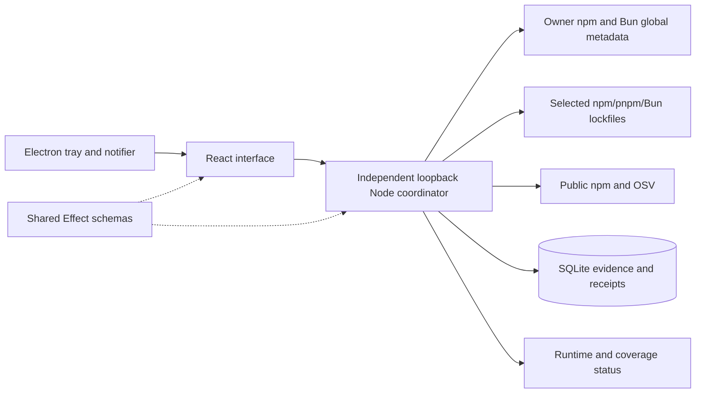
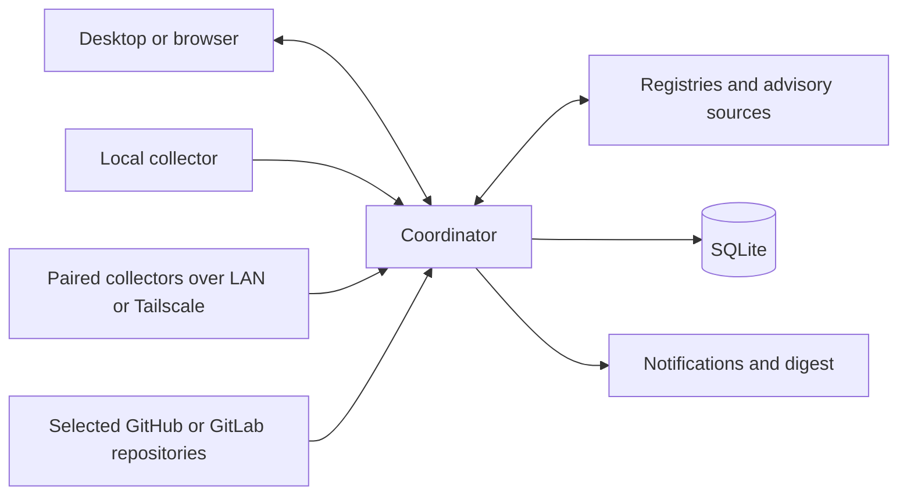

# Architecture

## Implemented local monitoring

`apps/web` owns rendering, TanStack routes, shared semantic controls, and validated polling/cache boundaries. `apps/server` owns a thin authenticated HTTP boundary, the focused monitoring coordinator, SQLite storage, and input/source adapters. `apps/desktop` is a sandboxed client with a narrow folder-picker preload, native tray, and notifier. `packages/contracts` owns status, request, evidence, and response schemas. Development runs the frontend and coordinator separately; desktop uses the built application.

Web controls are source-owned shadcn/Base UI components under `src/components/ui`, adapted from T3 Code with its MIT notice bundled in public assets. `ui.tsx` retains the app-level semantic wrappers and evidence/progress controls; `monitoring-view.ts` owns pure filtering, grouping, counts, and row matching. Needs attention and Projects render stable target IDs, while open evidence sheets resolve selected IDs against the current validated snapshot. This keeps presentation independent of collector and registry details without adding a new process or wire contract.

Web development uses ports `4317` (frontend) and `4318` (coordinator); the built browser application uses `4318`. Electron uses the stable `versionstead://app/` renderer origin, serves the built web files itself (`web-files.ts` shares the coordinator's allowlist and headers), and discovers an existing private coordinator or starts a detached Node 24 coordinator on a dynamic loopback port. The stable renderer origin preserves theme settings without reserving a fixed desktop port.

The shared title bar reserves the native window-controls area and uses native drag regions. `workspace-chrome.tsx` owns sidebar visibility and return-to-workspace navigation; `settings-navigation.ts` owns the settings search catalog. Settings and paired-PC pages load as a separate route chunk, fetched once the shell has rendered so that they still open after monitoring stops; the shell keeps settings navigation and utility controls. Setting rows expose focus targets only within the settings page. The narrow preload exposes the native platform and validated System/Light/Dark appearance IPC. Desktop main owns caption appearance and debounced, serialized window-settings persistence; contracts validate IPC input and saved geometry. Window preferences are device-local and separate from coordinator monitoring settings.

`in-app-notifications.tsx` bridges shared action feedback and validated notification summaries to one source-owned shadcn/Base UI toaster. `notification-history.ts` retains at most 200 opaque summary identities in renderer-local storage, independently of server delivery receipts. Electron forwards native show events through a narrow subscription; the renderer decodes the shared summary contract before rendering or navigating. This covers summaries acknowledged by the native notifier between web polls without acknowledging an OS delivery from the renderer. The shared app logo follows semantic accent tokens; native icons and the static favicon use the same V mark.

Desktop startup reuses compatible coordinators. A legacy interactive session host missing scan-progress or the `npm-bun-global-v1` collector marker is gracefully stopped through its authenticated API and replaced using the same database after startup prerequisites pass. An explicit tray restart uses the same path. Boot/background hosts retain their identity and account; they require their host-specific restart procedure. A compatible boot host receives validated owner source configuration through authenticated `POST /api/global-tools/sources` when Electron attaches; changing sources during a PC scan is rejected.

The coordinator persists settings, projects, current evidence, bounded scan history, notification fingerprints, and delivery receipts in SQLite. A separate SQLite exclusive lock prevents duplicate writers. Runtime capabilities are protected by Windows DPAPI plus filesystem ACLs; authenticated requests validate Effect schemas at the boundary. Browser sessions use HttpOnly SameSite cookies. Application preferences, protected credentials, pairing records, and received PC evidence share the existing SQLite database. `ApplicationService` owns their state and focused adapters implement provider file reads, Git discovery, and paired HTTPS requests. Its single save path compares the durable state with what it last wrote, counting each received PC snapshot by its digest and leaving a PC's check time out, so a refresh that brings the evidence already held and no new connection error writes nothing; the check time is saved with the next change, so after a restart retained evidence can look older than the last contact, never newer. Tools (Git, GitHub and GitLab CLIs, Tailscale, ssh) are probed when the coordinator starts, on an explicit refresh, and again when Git context is switched, not while the interface polls. GitHub/GitLab repository inputs use the same project parser, lookup stages, scan queue, evidence/history, and notifications as selected folders. Paired PCs exchange evidence through a separate authenticated HTTPS listener; the administrative coordinator stays on loopback.

The structure borrows T3 Code’s separation of desktop, web, server, and contracts, with semantic UI styling and thin service boundaries. Reference: local clone `D:\production_code\t3code`, revision `54084ae1e6`. Full event-sourced orchestration is unnecessary for this workload.

## Monitoring flow and remaining extensions

Each paired PC runs the same coordinator and scanners locally, keeping its own scheduling, durable evidence, and notifications. Its optional scoped HTTPS listener shares evidence and accepts selected-source scan requests. A receiving coordinator stores the last validated receipt; its UI shows received times and unavailable peers. No separate collector package or arbitrary remote command runner is needed for this flow.

The independent process already survives Electron UI exit. `scripts/windows-background.ps1` can register a LocalService boot task to own it after sign-out. Elevated installation, actual folder access, boot, and sign-out remain manual acceptance gates; see [Windows background verification](windows-background.md). A user-session notifier delivers pending findings when Electron next opens. Automatic tray startup at login is not configured.

The coordinator initially runs on the owner’s main computer. Central work pauses while it sleeps or is off. Paired coordinators retain their own durable results; the client polls received snapshots every 30 seconds and retains its last receipt when unreachable. The interface's five-second application read carries only each PC's evidence digest; `GET /api/application/computers/{id}/snapshot` returns one PC's validated evidence with its digest, check time, and error, and the interface fetches it when a digest it does not hold appears (on load, after that PC's own refresh, or after the 30-second refresh found changes). Central notification aggregation and push delivery remain deferred; the UI shows disconnected devices and stale evidence. Moving the coordinator to an always-on computer is a later deployment choice.

## Evidence model and next extensions

| Record             | Essential information                                                                                     |
| ------------------ | --------------------------------------------------------------------------------------------------------- |
| Device             | Stable ID, label, OS/architecture, enrollment state, last contact                                         |
| Project            | Stable ID, local path or repository/ref, maintenance mode, ecosystem/workspaces                           |
| Installation       | Device, source/package identity, path, installed version, release channel                                 |
| Dependency         | Project/workspace, ecosystem/name, requested range, resolved version, registry/Git/local origin           |
| Scan               | Subject, adapter and version, timestamps, input revision/hash, outcome, coverage, sanitized diagnostics   |
| Finding            | Kind, normalized identity, affected subjects, supporting scan, candidate/fixed versions, advisory aliases |
| Notification state | Finding fingerprint, first/last seen, delivery state, snooze expiry                                       |

Model available updates, known vulnerabilities, scan outcomes, and freshness as separate facts. A package can be both current and vulnerable. A previous finding remains historical evidence after a failed scan; show it as stale rather than clearing it. Successful partial scans update only the coverage they establish.

For repository scans record the commit, manifest/lockfile path, and workspace. For installed applications record the actual package source and channel. Preserve native version strings; use ecosystem-specific comparison and constraints. Do not infer package identity from a display name alone.

## Adapter boundaries

Manual This PC updates use a focused adapter imported only by the Electron `GlobalToolUpdateRunner`. Trusted-frame IPC rechecks the current coordinator snapshot and the adapter resolves fresh manager/root ownership before invoking argument-array npm/Bun installs. Root locks, bounded process supervision, exact-version verification, and a PC rescan establish the terminal result. The coordinator has no updater HTTP endpoint and retains read-only scan behavior. Installer output/state remains transient desktop memory. See [Global tool updates](global-tool-updates.md).

| Adapter             | Evidence and limits                                                                                                                                                     |
| ------------------- | ----------------------------------------------------------------------------------------------------------------------------------------------------------------------- |
| PC global tools     | Implemented: npm/Bun detection, actual global roots and installed manifests, stable public npm latest-version checks. Private/local/unknown origins stay unverified.    |
| macOS inventory     | Homebrew formula/cask metadata first; manual installations require explicit further support.                                                                            |
| Linux inventory     | Distribution package manager and repository identity; use vendor-aware vulnerability data for backports.                                                                |
| JavaScript projects | Implemented: npm package-lock v2/v3 and pnpm v9 importer/snapshot and Bun text v0/v1 workspace/catalog evidence; private/Git/local origins excluded from public checks. |
| .NET projects       | NuGet manifests and available resolved assets/lockfiles; never implicitly restore during a background scan.                                                             |
| Rust projects       | Cargo manifests and lockfile; distinguish registry, Git, and local dependencies.                                                                                        |
| GitHub/GitLab       | Implemented: read-only retrieval of selected manifests/lockfiles at a recorded commit; obey rate limits.                                                                |
| Advisory lookup     | Implemented: bounded OSV npm querybatch and advisory details, plus direct npm-registry SemVer updates (metadata/details cached, one retry). Other ecosystems deferred.  |

Adapters return typed evidence and diagnostics; they do not directly send notifications. Avoid a generic plugin framework until real adapters establish what is common.

OSV supports several relevant lockfile formats, but supported text `bun.lock` does not imply support for older binary `bun.lockb`. Missing lockfiles mean limited coverage, not a successful scan of transitive dependencies. Registry authentication, prereleases, withdrawn versions, and update channels need explicit handling.

A pnpm lockfile (read up to 10 MiB) is parsed on a short-lived worker thread, so parsing a large file no longer blocks the coordinator's event loop; the coordinator still validates what the worker posts, and the scan's signal terminates the worker when a project is removed or the coordinator shuts down. The worker is `adapters/projects.ts` itself, started with the lockfile as its data, so the server must stay unbundled (a single-file bundle would rerun the coordinator's entry point in the worker). Duplicate keys are found with one set per map, so that check is linear and the YAML pnpm writes parses in time linear in its size; other input is bounded only by the deadline and heap cap below. YAML features pnpm never writes (anchors, aliases, collection keys) are reported as unsupported and repeated keys as malformed. A parse is cut off after 30 seconds or at a 1 GiB worker heap and reported as a failed check, which keeps the previous evidence and its age. See [security](security.md#trust-boundaries) and the [Wave 3 measurements](development.md#wave-3-verification-october-9-2026).

## Persistence, scheduling, and notifications

Local owner-session projects use the focused `outdated.ts` adapter during a separate native-version progress stage. Installed npm 11/pnpm 10/Bun 1.4 commands inspect each importer with constrained arguments, deadlines, output limits, and script/hook suppression. pnpm performs latest and compatible queries separately: its JSON `wanted` is the locked target, and recursive JSON can collapse multiple importer versions. `lookupDependencies` merges verified native candidates by dependency ID before querying remaining public names; OSV still uses original lockfile identities. An optional per-dependency source string distinguishes manager results from registry fallback. Provider repositories and noninteractive hosts never receive a native-command context. [Package-manager checks](package-manager-checks.md) records the verified flags, format versions, and fallback rules.

Node 24’s built-in SQLite stores the validated personal-scale snapshot plus durable scheduling/fingerprint metadata, with a schema-version gate and WAL. Schema version 2 keeps one meta row for everything except projects and findings (including the due times and notification fingerprints), one row per project, and one row per finding subject. Each save compares every row's JSON with what it last wrote and, in one transaction, rewrites only changed rows and deletes removed subjects, so a project scan rewrites that project, its findings, and the meta row instead of the whole snapshot (measured on a synthetic 50-project workspace in [Wave 3 verification](development.md#wave-3-verification-october-9-2026)). Every save still serializes all subjects to compare them, and a save that changes the meta row rewrites all of it; that row grows with pending notifications, so skipping unchanged subjects and giving notifications their own rows are the upgrades if either measurably matters. Reads validate every row and fail rather than drop damaged data. A version 1 database is migrated in one transaction that writes the new rows and then drops the old table, so a failed migration leaves it unchanged. Earlier builds refuse a version 2 database, so downgrading is unsupported; restore a data-directory backup taken before the upgrade instead. The scan queue coalesces each PC/project target; a manual request for the target already scanning queues one rescan after it, and removing a project cancels its active scan. A failed durable write is recorded on the attempt as a sanitized error, and the previous saved evidence is retained. Persisted due times survive restarts. Defaults are PC every six hours and projects hourly; intervals range from five minutes to seven days. Pause stops automatic scheduling while manual scan remains available. History is bounded to 200 attempts and selected projects to 50.

Project and global-tool version checks attempt every eligible unique canonical direct package name. Project OSV queries cover eligible resolved dependencies, including transitives, in batches of 100; a failed batch does not skip later batches. All discovered advisory IDs receive a detail lookup. Registry and advisory-detail stages each use at most four concurrent requests, with independent budgets of at least 90 seconds scaled by work count and the 12-second request timeout. The sequential OSV stage scales its budget by batch count, as does the native-version stage (also at least 90 seconds, scaled by 10 seconds per batch, doubled for pnpm, plus 30 seconds); records it does not reach use the registry stage. Progress counts completed attempts against the full stage workload; coverage records successful checks separately. Individual failures remain unknown and interrupted scans preserve prior evidence. OSV pagination still reports incomplete coverage rather than a clean result.

One coordinator-wide in-memory cache serves every project and This PC scan, so a restart starts it cold. It holds abbreviated npm metadata for at most 2,000 package names (least recently used evicted), fresh for 30 minutes and then revalidated with `If-None-Match` using the `ETag` the registry supplied (an entry without one is fetched in full); one live check on October 8, 2026 (left-pad) found that the registry sends a weak `ETag` for the abbreviated-metadata media type and answers a matching request with `304`. Only metadata that passed the checks for a fresh response (package identity, latest tag, version count) is cached, and it keeps each version's `deprecated` and `hasInstallScript` values rather than whole manifests. OSV advisory details are cached by advisory ID and the `modified` time that `querybatch` returns, bounded the same way, and are not reused when no `modified` time is returned; the `querybatch` queries themselves are not cached. Concurrent lookups of one entry share a single request. Evidence keeps the time the registry last confirmed the data: This PC's `updateCheckedAt` is the fetch or `304` time, not the scan time; a project's evidence records its scan time, so the registry data behind it can be up to 30 minutes older. A failed revalidation fails the check like any other lookup failure: the dependency stays unknown, the previous evidence keeps its age, and stale metadata is never served as current. Each public request is retried once, after the `Retry-After` pause the source asked for (seconds or an HTTP date) or 500 ms, plus up to 500 ms of jitter, when the source answers 429 or 503 or the request fails before any response arrives (a connection that drops while a body is being read is not retried). A request that exceeds its 12-second timeout, a cancelled scan, and any other status are not retried, and neither is a request whose pause would reach past its stage budget, so a rate-limited registry leaves the affected names unchecked instead of extending the scan.

The first PC scan requires an explicit request; later attempts follow the configured cadence. Selected projects keep their automatic first scan. Live active/queued targets and adapter stage/count callbacks are derived in memory and exposed through the validated snapshot. The UI polls every second while queued/active and every five seconds while idle. Unknown work totals use indeterminate progress; durable history records terminal and interrupted outcomes. Every durable change to the monitoring snapshot advances its revision (`<boot id>-<counter>`), which `GET /api/monitoring` sends as its `ETag`; the coordinator validates and serializes the stable snapshot once per revision, splices in per-request scan progress and notification summary, and answers a matching `If-None-Match` with an empty `304`. `GET /api/monitoring/progress` returns only those live fields with the revision, the notification cooldown, and the monitoring settings; Electron forwards the renderer's `If-None-Match`. The UI's polls read progress and fetch the snapshot (conditionally on its last `ETag`) only when the revision differs, after an action, or on explicit refresh; unchanged responses leave rendered state untouched, and the displayed snapshot takes its live fields from progress. Monitoring and application-settings polling pause while the page is hidden and resume immediately when it is visible. A coordinator without the progress endpoint (404) keeps full-snapshot polling until an explicit refresh. The desktop's 30-second tray refresh and notification poll read progress first as well and take the pause and notification settings from it. They read the snapshot only while a project command runs, to stop a command whose project or action was removed, keeping only each project's actions, and then only when the revision differs (conditionally on its last `ETag`). A coordinator whose progress has no settings (builds before the `v8` marker) is read when the revision differs, and one without the progress endpoint in full on every poll. While a command runs, each durable change, such as a scan starting or finishing, still costs the next poll one snapshot read.

Notifications retain durable per-finding fingerprints/events but present one count summary after the queue has been idle for two seconds; its title leads with new security advisories, otherwise available updates. Project update counts collapse duplicate importer rows by package/resolved/candidate identity; PC observations retain manager/global-root/alias identity. Obsolete pending events are pruned, and findings first seen while notifications are off count as already announced. Frozen summary receipts acknowledge only the events represented by that presentation, atomically storing a shared five-minute cooldown in the persisted monitoring snapshot. Findings arriving during presentation remain pending. Electron acknowledges after the native notification's show event and retries failed receipts; a crash between OS presentation and the saved receipt can repeat one summary. Signed-out backlogs combine on reconnection. Daily digests, reminders, quiet hours, and snoozes remain deferred.

Global source configuration records manager availability/version, canonical root, registry classification, excluded private scopes, checked time, and sanitized errors. Session scans rediscover sources; background scans read only captured owner metadata. npm scans direct global package directories; Bun resolves its exact configured/default global directory and reads that directory's direct dependency declarations and installed manifests, excluding hoisted transitive packages and parent project manifests. It never invokes `bun pm ls`, whose missing-manifest fallback can identify a parent project. Public checks reuse the project's bounded registry adapter, compare stable SemVer against `latest`, and preserve failures as unknown. Inventory remains bounded at 500 direct tools per source with 15-second discovery commands; version lookups cover all eligible names within the workload-scaled budget described above. Unsupported Bun configuration forms remain unknown instead of exposing package identities. No package install/update command runs during scans. Explicit owner-session updates are documented in [Global tool updates](global-tool-updates.md).

On the first load of older stored data, only active Windows PC evidence, PC findings, and their pending notifications are cleared. Device/settings/projects/history and delivered receipts are retained. Failed root reads preserve prior installations; successful metadata coverage or confirmed manager removal retires obsolete roots. A failed public lookup retains previous update evidence with its age.

## References

- [T3 Code](https://github.com/pingdotgg/t3code)
- [npm global roots](https://docs.npmjs.com/cli/v11/commands/npm-root/)
- [Bun package metadata utilities](https://bun.com/docs/pm/cli/pm) and [global configuration](https://bun.com/docs/runtime/bunfig)
- [Bun 1.4 global directory precedence](https://github.com/oven-sh/bun/blob/bun-v1.4.0/src/install/PackageManager/PackageManagerOptions.rs#L283)
- [Homebrew manual](https://docs.brew.sh/Manpage)
- [npm outdated semantics](https://docs.npmjs.com/cli/v11/commands/npm-outdated/)
- [OSV-Scanner supported formats](https://google.github.io/osv-scanner/supported-languages-and-lockfiles/)
- [.NET package list and restore behavior](https://learn.microsoft.com/en-us/dotnet/core/tools/dotnet-package-list)
- [GitHub repository contents](https://docs.github.com/en/rest/repos/contents) and [GitLab repository files](https://docs.gitlab.com/api/repository_files/)
- [Tailscale device connectivity](https://tailscale.com/docs/how-to/connect-to-devices)

These are planning references, not a guarantee that a particular tool version or format has been implemented. Verify documentation against pinned versions while implementing each adapter.

## Settings, provider scans, and PC pairing

Wire schemas live in `packages/contracts/src/application.ts`. Authenticated `/api/application/*` handlers validate requests and invoke `ApplicationService`; they never return protected secret entries. Provider repositories are selected by account-scoped IDs and branch/ref, then resolved to one immutable commit per scan. Only supported manifests, workspace package manifests, lockfiles, and selected-root registry configuration are read. Nothing is cloned, restored, or built. Git discovery reads branch, commit, and tracked working-tree status with repository filters and fsmonitor disabled and submodule status checks suppressed.

The paired listener binds a specific LAN/Tailscale IPv4 address, serves only pair/evidence/scan/self-revoke operations, and uses a Windows-generated PFX protected with DPAPI. Invites carry a certificate pin and five-minute one-time code. Each paired client receives a separately revocable token; the host stores its hash. Clients verify the certificate pin before sending HTTP credentials and validate device identity, response schemas, and per-request nonces. Remote evidence excludes local folder/global-root paths and notification payloads. See [setup and limitations](settings-and-connections.md).

T3 references for this adaptation include `SettingsSidebarNav.tsx`, `SourceControlSettings.tsx`, `SidebarUpdatePill.tsx`, `DesktopUpdateStatusIcon.tsx`, `ConnectionsSettings.logic.ts`, and `KeybindingsSettings.logic.ts` under `apps/web/src/components`. Versionstead uses its own scanner and small SQLite state.

Bun project scans use a bounded JSONC syntax tree and null-prototype values, then validate package tuples and workspace paths before fetching child manifests. Direct dependencies keep their original catalog request and a separate effective SemVer range for compatible updates. The project scanner and global-tool capture share the Bun configuration decoder; selected-root private/scoped or unsupported routing stays excluded from public checks. No Bun executable is needed to scan a project.

Connections uses the same validated pairing parser in the renderer and server. A full HTTPS link carries the legacy invitation in its fragment; it preserves the device ID, private IPv4 endpoint, and certificate pin. Manual host/code input must match that identity. Saved environments persist their enabled state and optional SSH target alongside protected credentials and retained evidence. Disabled environments do not poll or accept refresh/scan actions.

The focused `ssh-connections.ts` adapter reads simple owner SSH configuration as data and starts bounded, cancellable OpenSSH local forwards. `ApplicationService` coalesces and reuses one live tunnel per environment, reconnects after failure, and closes it on disable/removal/shutdown. The peer transport connects through the loopback tunnel while retaining the original HTTPS authority, device checks, and pin verification before sending credentials. No remote command is executed or monitor installed. SSH is unavailable to noninteractive boot hosts; direct LAN/Tailscale pairing remains their transport.

The `settings-repositories-connections-v8` marker gates the current contracts and handlers, including Project settings, native package-manager checks, snapshot revisions with the progress endpoint, and per-PC evidence reads (the application read carries each PC's evidence digest, not its snapshot). Desktop startup upgrades older interactive session hosts while preserving state; boot hosts retain their existing account and restart procedure. Connections composes shared settings groups, Base UI menus, and native dialogs. Shared Select portals use the containing native dialog when present, keeping popups in its top layer with correct hit testing and focus behavior.

Optional project icon/action fields live in the validated project records of the persisted snapshot; older records remain valid. `project-settings.ts` owns shared schemas and bounds. Project PATCH validates partial metadata changes and preserves source/evidence identity. Paired evidence strips action definitions. The renderer groups project identities and edits owner-local entries. The focused desktop `project-actions.ts` runner receives selected IDs plus the reviewed command through trusted-frame IPC, rechecks coordinator state, and starts bounded Windows PowerShell commands only on an explicit launch. The coordinator has no action execution HTTP endpoint and never imports that runner. See [Project settings](project-settings.md).
