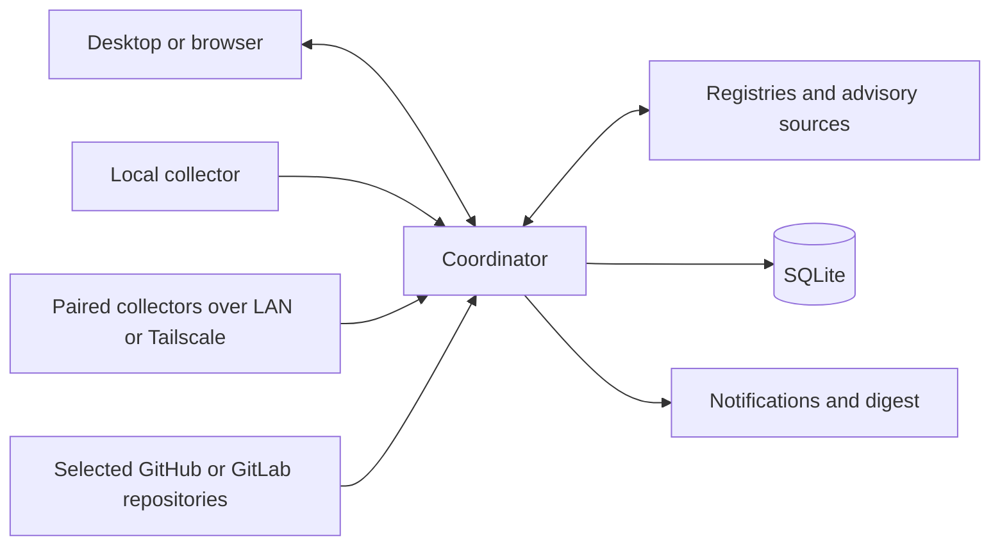

# Architecture

## Implemented local monitoring

`apps/web` owns rendering, TanStack routes, shared semantic controls, and one validated polling/cache boundary. `apps/server` owns a thin authenticated HTTP boundary, the focused monitoring coordinator, SQLite storage, and input/source adapters. `apps/desktop` is a sandboxed client with a narrow folder-picker preload, native tray, and notifier. `packages/contracts` owns status, request, evidence, and response schemas. Development runs the frontend and coordinator separately; desktop uses the built application.

Web controls are source-owned shadcn/Base UI components under `src/components/ui`, adapted from T3 Code with its MIT notice bundled in public assets. `ui.tsx` retains the app-level semantic wrappers and evidence/progress controls; `monitoring-view.ts` owns pure filtering, grouping, counts, and row matching. Needs attention and Projects render stable target IDs, while open evidence sheets resolve selected IDs against the current validated snapshot. This keeps presentation independent of collector and registry details without adding a new process or wire contract.

Web development uses ports `4317` (frontend) and `4318` (coordinator); the built browser application uses `4318`. Electron uses the stable `versionstead://app/` renderer origin and discovers an existing private coordinator or starts a detached Node 24 coordinator on a dynamic loopback port. The stable renderer origin preserves theme settings without reserving a fixed desktop port.

Desktop startup reuses compatible coordinators. A legacy interactive session host missing scan-progress or the `npm-bun-global-v1` collector marker is gracefully stopped through its authenticated API and replaced using the same database after startup prerequisites pass. An explicit tray restart uses the same path. Boot/background hosts retain their identity and account; they require their host-specific restart procedure. A compatible boot host receives validated owner source configuration through authenticated `POST /api/global-tools/sources` when Electron attaches; changing sources during a PC scan is rejected.

The coordinator persists settings, projects, current evidence, bounded scan history, notification fingerprints, and delivery receipts in SQLite. A separate SQLite exclusive lock prevents duplicate writers. Runtime capabilities are protected by Windows DPAPI plus filesystem ACLs; authenticated requests validate Effect schemas at the boundary. Browser sessions use HttpOnly SameSite cookies. No remote collector or Git host integration exists.

The structure borrows T3 Code’s separation of desktop, web, server, and contracts, with semantic UI styling and thin service boundaries. Reference: local clone `D:\production_code\t3code`, revision `54084ae1e6`. Full event-sourced orchestration is unnecessary for this workload.

## Planned monitoring flow

Use one coordinator and a collector on each enrolled computer. Collectors inspect local state; the coordinator owns scheduling, stored history, correlation, and notifications. Start both roles in one local process. Add an independent collector mode only when the second-device milestone needs it, sharing the scanner implementation.

The independent process already survives Electron UI exit. `scripts/windows-background.ps1` can register a LocalService boot task to own it after sign-out. Elevated installation, actual folder access, boot, and sign-out remain manual acceptance gates; see [Windows background verification](windows-background.md). A user-session notifier delivers pending findings when Electron next opens. Automatic tray startup at login is not configured.

The coordinator initially runs on the owner’s main computer. Central work pauses while it sleeps or is off. Remote collectors retain bounded pending results and reconnect with backoff once implemented; the UI shows disconnected devices and stale evidence. Moving the coordinator to an always-on computer is a later deployment choice.

## Evidence model and next extensions

| Record             | Essential information                                                                                     |
| ------------------ | --------------------------------------------------------------------------------------------------------- |
| Device             | Stable ID, label, OS/architecture, enrollment state, last contact                                         |
| Project            | Stable ID, local path or repository/ref, maintenance mode, ecosystem/workspaces                           |
| Installation       | Device, source/package identity, path, installed version, release channel                                 |
| Dependency         | Project/workspace, ecosystem/name, requested range, resolved version, registry/Git/local origin           |
| Scan               | Subject, adapter and version, timestamps, input revision/hash, outcome, coverage, sanitized diagnostics   |
| Finding            | Kind, normalized identity, affected subjects, supporting scan, candidate/fixed versions, advisory aliases |
| Notification state | Finding fingerprint, first/last seen, delivery state, snooze expiry                                       |

Model available updates, known vulnerabilities, scan outcomes, and freshness as separate facts. A package can be both current and vulnerable. A previous finding remains historical evidence after a failed scan; show it as stale rather than clearing it. Successful partial scans update only the coverage they establish.

For repository scans record the commit, manifest/lockfile path, and workspace. For installed applications record the actual package source and channel. Preserve native version strings; use ecosystem-specific comparison and constraints. Do not infer package identity from a display name alone.

## Adapter boundaries

| Adapter             | Evidence and limits                                                                                                                                                  |
| ------------------- | -------------------------------------------------------------------------------------------------------------------------------------------------------------------- |
| PC global tools     | Implemented: npm/Bun detection, actual global roots and installed manifests, stable public npm latest-version checks. Private/local/unknown origins stay unverified. |
| macOS inventory     | Homebrew formula/cask metadata first; manual installations require explicit further support.                                                                         |
| Linux inventory     | Distribution package manager and repository identity; use vendor-aware vulnerability data for backports.                                                             |
| JavaScript projects | Implemented: npm package-lock v2/v3 and pnpm v9 importer/snapshot evidence; private/Git/local origins excluded from public checks.                                   |
| .NET projects       | NuGet manifests and available resolved assets/lockfiles; never implicitly restore during a background scan.                                                          |
| Rust projects       | Cargo manifests and lockfile; distinguish registry, Git, and local dependencies.                                                                                     |
| GitHub/GitLab       | Read-only retrieval of selected manifests/lockfiles at a recorded commit; obey rate limits.                                                                          |
| Advisory lookup     | Implemented: bounded OSV npm querybatch and advisory details, plus direct npm-registry SemVer updates. Other ecosystems deferred.                                    |

Adapters return typed evidence and diagnostics; they do not directly send notifications. Avoid a generic plugin framework until real adapters establish what is common.

OSV supports several relevant lockfile formats, but supported text `bun.lock` does not imply support for older binary `bun.lockb`. Missing lockfiles mean limited coverage, not a successful scan of transitive dependencies. Registry authentication, prereleases, withdrawn versions, and update channels need explicit handling.

## Persistence, scheduling, and notifications

Node 24’s built-in SQLite stores one validated personal-scale snapshot plus durable scheduling/fingerprint metadata atomically, with a schema-version gate and WAL. The scan queue coalesces each PC/project target; persisted due times survive restarts. Defaults are PC every six hours and projects hourly; intervals range from five minutes to seven days. Pause stops automatic scheduling while manual scan remains available. History is bounded to 200 attempts and selected projects to 50.

Project and global-tool version checks attempt every eligible unique canonical direct package name. Project OSV queries cover eligible resolved dependencies, including transitives, in batches of 100; a failed batch does not skip later batches. All discovered advisory IDs receive a detail lookup. Registry and advisory-detail stages each use at most four concurrent requests, with independent budgets of at least 90 seconds scaled by work count and the 12-second request timeout. The sequential OSV stage scales its budget by batch count. Progress counts completed attempts against the full stage workload; coverage records successful checks separately. Individual failures remain unknown and interrupted scans preserve prior evidence. OSV pagination still reports incomplete coverage rather than a clean result. Source caching and backoff remain future work.

The first PC scan requires an explicit request; later attempts follow the configured cadence. Selected projects keep their automatic first scan. Live active/queued targets and adapter stage/count callbacks are derived in memory and exposed through the validated snapshot. The UI polls every second while queued/active and every five seconds while idle. Unknown work totals use indeterminate progress; durable history records terminal and interrupted outcomes.

Notifications retain durable per-finding fingerprints/events but present one count summary after the queue has been idle for two seconds. Project update counts collapse duplicate importer rows by package/resolved/candidate identity; PC observations retain manager/global-root/alias identity. Obsolete pending events are pruned. Frozen summary receipts acknowledge only the events represented by that presentation, atomically storing a shared five-minute cooldown in the existing SQLite snapshot. Findings arriving during presentation remain pending. Electron acknowledges after the native notification's show event and retries failed receipts; a crash between OS presentation and the saved receipt can repeat one summary. Signed-out backlogs combine on reconnection. Daily digests, reminders, quiet hours, and snoozes remain deferred.

Global source configuration records manager availability/version, canonical root, registry classification, excluded private scopes, checked time, and sanitized errors. Session scans rediscover sources; background scans read only captured owner metadata. npm scans direct global package directories; Bun resolves its exact configured/default global directory and reads that directory's direct dependency declarations and installed manifests, excluding hoisted transitive packages and parent project manifests. It never invokes `bun pm ls`, whose missing-manifest fallback can identify a parent project. Public checks reuse the project's bounded registry adapter, compare stable SemVer against `latest`, and preserve failures as unknown. Inventory remains bounded at 500 direct tools per source with 15-second discovery commands; version lookups cover all eligible names within the workload-scaled budget described above. Unsupported Bun configuration forms remain unknown instead of exposing package identities. No package install/update command runs.

On the first load of older stored data, only active Windows PC evidence, PC findings, and their pending notifications are cleared. Device/settings/projects/history and delivered receipts are retained. Failed root reads preserve prior installations; successful metadata coverage or confirmed manager removal retires obsolete roots. A failed public lookup retains previous update evidence with its age.

## References

- [T3 Code](https://github.com/pingdotgg/t3code)
- [npm global roots](https://docs.npmjs.com/cli/v11/commands/npm-root/)
- [Bun package metadata utilities](https://bun.com/docs/pm/cli/pm) and [global configuration](https://bun.com/docs/runtime/bunfig)
- [Bun 1.4 global directory precedence](https://github.com/oven-sh/bun/blob/bun-v1.4.0/src/install/PackageManager/PackageManagerOptions.rs#L283)
- [Homebrew manual](https://docs.brew.sh/Manpage)
- [npm outdated semantics](https://docs.npmjs.com/cli/v11/commands/npm-outdated/)
- [OSV-Scanner supported formats](https://google.github.io/osv-scanner/supported-languages-and-lockfiles/)
- [.NET package list and restore behavior](https://learn.microsoft.com/en-us/dotnet/core/tools/dotnet-package-list)
- [GitHub repository contents](https://docs.github.com/en/rest/repos/contents) and [GitLab repository files](https://docs.gitlab.com/api/repository_files/)
- [Tailscale device connectivity](https://tailscale.com/docs/how-to/connect-to-devices)

These are planning references, not a guarantee that a particular tool version or format has been implemented. Verify documentation against pinned versions while implementing each adapter.
