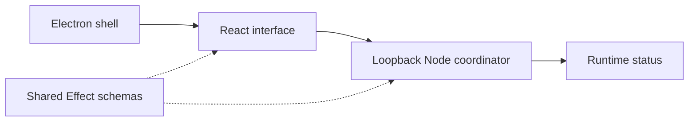
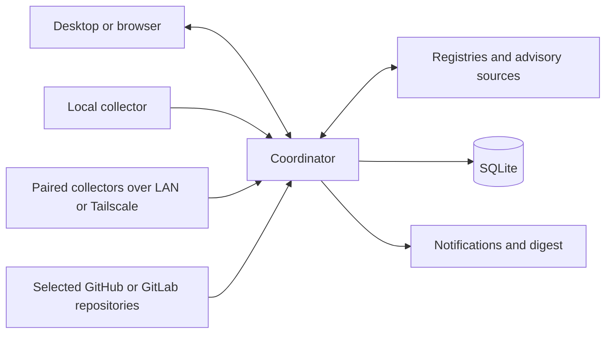

# Architecture

## Implemented foundation

`apps/web` owns rendering and routing. `apps/server` owns the status HTTP boundary and serves the built web application. `apps/desktop` hosts the local application in Electron. `packages/contracts` supplies validated shared contracts. Development runs the web development server and coordinator separately; the desktop build uses the built application.

Web development uses ports `4317` (frontend) and `4318` (coordinator); the built browser application uses `4318`. Electron uses a stable `versionstead://app/` renderer origin backed by its own coordinator on a dynamic loopback port. The stable renderer origin preserves local settings without reserving a fixed desktop port.

There is currently no inventory database, scanner, remote collector, repository integration, or notification pipeline. The status response describes the running foundation only.

The structure borrows T3 Code’s separation of desktop, web, server, and contracts, with semantic UI styling and thin service boundaries. Reference: local clone `D:\production_code\t3code`, revision `54084ae1e6`. Full event-sourced orchestration is unnecessary for this workload.

## Planned monitoring flow

Use one coordinator and a collector on each enrolled computer. Collectors inspect local state; the coordinator owns scheduling, stored history, correlation, and notifications. Start both roles in one local process. Add an independent collector mode only when the second-device milestone needs it, sharing the scanner implementation.

The coordinator initially runs on the owner’s main computer. Central work pauses while it sleeps or is off. Remote collectors retain bounded pending results and reconnect with backoff once implemented; the UI shows disconnected devices and stale evidence. Moving the coordinator to an always-on computer is a later deployment choice.

## Data model to introduce with scanning

| Record             | Essential information                                                                                     |
| ------------------ | --------------------------------------------------------------------------------------------------------- |
| Device             | Stable ID, label, OS/architecture, enrollment state, last contact                                         |
| Project            | Stable ID, local path or repository/ref, maintenance mode, ecosystem/workspaces                           |
| Installation       | Device, source/package identity, path, installed version, release channel                                 |
| Dependency         | Project/workspace, ecosystem/name, requested range, resolved version, registry/Git/local origin           |
| Scan               | Subject, adapter and version, timestamps, input revision/hash, outcome, coverage, sanitized diagnostics   |
| Finding            | Kind, normalized identity, affected subjects, supporting scan, candidate/fixed versions, advisory aliases |
| Notification state | Finding fingerprint, first/last seen, delivery state, snooze expiry                                       |

Model available updates, known vulnerabilities, scan outcomes, and freshness as separate facts. A package can be both current and vulnerable. A previous finding remains historical evidence after a failed scan; show it as stale rather than clearing it. Successful partial scans update only the coverage they establish.

For repository scans record the commit, manifest/lockfile path, and workspace. For installed applications record the actual package source and channel. Preserve native version strings; use ecosystem-specific comparison and constraints. Do not infer package identity from a display name alone.

## Adapter boundaries

| Adapter             | Evidence and limits                                                                                         |
| ------------------- | ----------------------------------------------------------------------------------------------------------- |
| Windows inventory   | Structured WinGet/package metadata; unmatched installations have unknown update status.                     |
| macOS inventory     | Homebrew formula/cask metadata first; manual installations require explicit further support.                |
| Linux inventory     | Distribution package manager and repository identity; use vendor-aware vulnerability data for backports.    |
| JavaScript projects | Manifest ranges plus supported lockfiles; report unresolved/private/Git/local packages separately.          |
| .NET projects       | NuGet manifests and available resolved assets/lockfiles; never implicitly restore during a background scan. |
| Rust projects       | Cargo manifests and lockfile; distinguish registry, Git, and local dependencies.                            |
| GitHub/GitLab       | Read-only retrieval of selected manifests/lockfiles at a recorded commit; obey rate limits.                 |
| Advisory lookup     | OSV-Scanner is the initial candidate; verify actual format support against pinned-tool fixtures.            |

Adapters return typed evidence and diagnostics; they do not directly send notifications. Avoid a generic plugin framework until real adapters establish what is common.

OSV supports several relevant lockfile formats, but supported text `bun.lock` does not imply support for older binary `bun.lockb`. Missing lockfiles mean limited coverage, not a successful scan of transitive dependencies. Registry authentication, prereleases, withdrawn versions, and update channels need explicit handling.

## Persistence, scheduling, and notifications

Add SQLite when the first real scan needs persistence, with schema migrations and a documented backup path. Store current snapshots and bounded history; retain enough evidence to explain findings without copying source code. A single writer and a small bounded job queue are sufficient for personal usage.

Separate scan execution from source lookups so registry responses can be cached and shared across devices. Use timeouts, backoff, cancellation, and per-source concurrency limits. An interrupted scan must not overwrite the last successful snapshot.

Notifications depend on a durable finding fingerprint and notification state. Repeated unchanged scans should stay quiet; newly affected subjects, changed severity/fix availability, and explicit reminders can create new events. Implement immediate vulnerability alerts and an ordinary-update digest only after persistence exists.

## References

- [T3 Code](https://github.com/pingdotgg/t3code)
- [WinGet structured package command](https://github.com/microsoft/winget-cli/blob/master/src/PowerShell/Help/Microsoft.WinGet.Client/Get-WinGetPackage.md)
- [Homebrew manual](https://docs.brew.sh/Manpage)
- [npm outdated semantics](https://docs.npmjs.com/cli/v11/commands/npm-outdated/)
- [OSV-Scanner supported formats](https://google.github.io/osv-scanner/supported-languages-and-lockfiles/)
- [.NET package list and restore behavior](https://learn.microsoft.com/en-us/dotnet/core/tools/dotnet-package-list)
- [GitHub repository contents](https://docs.github.com/en/rest/repos/contents) and [GitLab repository files](https://docs.gitlab.com/api/repository_files/)
- [Tailscale device connectivity](https://tailscale.com/docs/how-to/connect-to-devices)

These are planning references, not a guarantee that a particular tool version or format has been implemented. Verify documentation against pinned versions while implementing each adapter.
