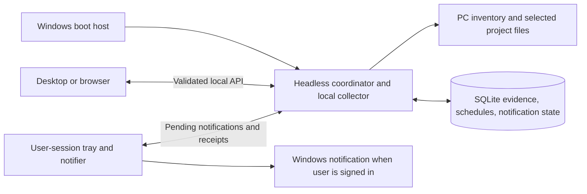

# First monitoring implementation

This accepted plan develops [roadmap milestone 1](roadmap.md) using the boundaries in [architecture](architecture.md). npm/Bun global-tool detection and stable public version checks, npm package-lock v2/v3 and pnpm v9 project scans, public npm/OSV checks, SQLite evidence, input fingerprints, scheduling, live progress, grouped notifications, and the Electron tray client are implemented. Windows registry/WinGet scanning has been replaced. The LocalService boot-task installer captures owner roots, but elevated installation, actual metadata/project access, reboot, and sign-out verification remain open. Read [development verification](development.md) and [Windows background setup](windows-background.md) for the shipped limits.

The firm requirement is **monitoring continues after the window closes and after Windows sign-out, and starts at Windows boot**. An Electron tray process or a login item alone cannot meet it. The PC must still be awake and powered on.

## Ownership and the T3 Code reference

Move the existing coordinator into one independent headless process. Windows owns its lifetime; Electron and the browser attach to it. Keep scanning, scheduling, SQLite, and notification decisions in `apps/server`; keep rendering in `apps/web`, desktop integrations in `apps/desktop`, and boundary schemas in `packages/contracts`. Use one local collector inside the coordinator initially.

UI close/sign-out disconnects the client and notifier; it does not stop the coordinator. Explicitly stopping background monitoring stops it. Findings detected while signed out remain pending for the notifier after the owner returns.

These patterns were checked against `D:\production_code\t3code`, revision `54084ae1e6c3`:

| Adopt                                                                                  | Observed source                                                                                                                                                             |
| -------------------------------------------------------------------------------------- | --------------------------------------------------------------------------------------------------------------------------------------------------------------------------- |
| Separate execution owner and client; thin transports invoke focused services.          | [T3 architecture](../../t3code/docs/internals/overview.md), [Effect service boundaries](../../t3code/docs/internals/effect-services.md)                                     |
| A real readiness check, owned-process cleanup, and bounded restart backoff.            | [Desktop backend manager](../../t3code/apps/desktop/src/backend/DesktopBackendManager.ts), especially `runBackendProcess` at line 440 and `makeBackendInstance` at line 635 |
| Server-owned SQLite with migrations, foreign keys, WAL, and bounded busy waits.        | [SQLite layer](../../t3code/apps/server/src/persistence/Layers/Sqlite.ts), `setup` at line 14                                                                               |
| Changed findings have stable identities; presentation links back to the affected item. | [Update notification identity](../../t3code/apps/web/src/components/ProviderUpdateLaunchNotification.logic.ts), `localEnvironmentUpdateNotificationKey` at line 763         |

T3 does not supply the Windows host needed here: [its service dispatcher](../../t3code/apps/server/src/cloud/bootService.ts), `selectBootServiceManager` at line 385, supports Linux and macOS only. Its [desktop lifecycle](../../t3code/apps/desktop/src/app/DesktopLifecycle.ts) quits after the last Windows window closes, and [desktop finalization](../../t3code/apps/desktop/src/app/DesktopApp.ts) stops its owned backends. Reuse the boundaries, not that ownership rule. Event sourcing, remote enrollment, and T3's staged runtime updater are unnecessary for this increment.

The current interface adapts T3's source-owned shadcn/Base UI [buttons](../../t3code/apps/web/src/components/ui/button.tsx), [badges](../../t3code/apps/web/src/components/ui/badge.tsx), [collapsibles](../../t3code/apps/web/src/components/ui/collapsible.tsx), [sheets](../../t3code/apps/web/src/components/ui/sheet.tsx), and [tables](../../t3code/apps/web/src/components/ui/table.tsx), retaining their MIT notice. The approved layout uses a 205 px sidebar, a 44 px brand bar, T3's [52 px page header and native font](../../t3code/apps/web/src/index.css), and Versionstead's green accent. [T3's connection rules](../../t3code/docs/internals/connection-runtime.md) also inform the disconnected scenario: connection health and evidence freshness are separate, and previous evidence stays readable.

## Resolve Windows hosting before registering anything

Prefer a native boot-triggered Task Scheduler host running noninteractively if it passes the required lifecycle and access checks. If Windows Service Control Manager integration is required, use a verified service-compatible host around the coordinator. Choose one; do not build both. A plain `node.exe` command is not automatically SCM-compatible: Windows expects a service process to connect through [StartServiceCtrlDispatcher](https://learn.microsoft.com/en-us/windows/win32/api/winsvc/nf-winsvc-startservicectrldispatchera).

The implemented host/account choice is a credentialless LocalService boot task. Its installer uses explicit executable/data paths, one process instance, bounded failure restart, graceful stop, and authenticated readiness/access probes. A real boot/sign-out run must still prove the lifecycle. Task Scheduler's [boot trigger](https://learn.microsoft.com/en-us/windows/win32/taskschd/boot-trigger-example--scripting-) and [security contexts](https://learn.microsoft.com/en-us/windows/win32/taskschd/security-contexts-for-running-tasks) describe that boundary; [S4U logon](https://learn.microsoft.com/en-us/windows/win32/api/taskschd/ne-taskschd-task_logon_type) excludes network and encrypted-file access and is not used.

Do not default to LocalSystem to avoid access work. Scope filesystem permissions to selected roots and the application's data directory. Capture npm/Bun availability, global locations, and public/private routing in the owner session before elevated installation. The LocalService host reads those configured manifests without discovering its own PATH/profile or executing owner-installed packages. Owner-session manager detection and background metadata freshness remain separate facts. Reconfigure after changing manager locations or routing; inaccessible or unknown sources preserve evidence. User credentials belong to Windows-managed storage if future sources need them, never application settings or logs.

A true service cannot display notifications directly from session 0. The implemented notifier runs in Electron's user session, following [Microsoft's service/UI guidance](https://learn.microsoft.com/en-us/windows/win32/services/interactive-services). Loopback binding does not authenticate a caller. Selected-root mutations and monitoring data require the owner capability; the runtime descriptor uses Windows DPAPI and filesystem ACLs. Request/response validation, strict host/origin policy, body limits, and constrained paths protect that boundary. External credentials and LAN access are not implemented.

## Three vertical increments

### 1. Independent coordinator and durable state

- Extract desktop's in-process server startup into the headless coordinator entry point. Desktop discovers and attaches to the existing instance; an already-open disconnected UI preserves in-memory evidence with its age. Current cold launch requires a ready coordinator and shows an actionable startup error if Node/access prevents it.
- Add SQLite migrations for selected roots, current evidence, scan attempts, and background settings. Make the coordinator the single writer. Mark interrupted attempts honestly without replacing the last successful snapshot.
- Add the selected Windows boot host with install, status, start, stop, restart, and remove-startup operations. Removing startup registration preserves evidence. UI close and notification-helper exit never invoke coordinator shutdown.
- Report process health separately from scheduling: starting/running/recovering/stopped/failed versus active/paused, plus last successful scan and next due scan. Readiness means persistence and API initialization succeeded.

**Done:** a focused lifecycle check starts the coordinator in isolated state, attaches and closes a client, verifies the coordinator still responds, restarts it, and verifies retained state. On Windows, record a boot-before-login and sign-out smoke run in which the coordinator writes timestamped evidence while no user session is active. Repeated UI launches must not create another coordinator or writer. Test deliberate stop separately from crash recovery.

### 2. Read-only PC and selected-project evidence

- Detect npm/Bun independently and read actual top-level global package manifests. Preserve manager/root/alias/package identity and installed version; compare supported stable public npm releases. Missing managers are skipped; private/local/unknown sources and unsupported channels remain unverified. No Windows registry or WinGet inventory is collected.
- Let the owner select local directories and choose **maintained by me** or **watch only**. Validate and authorize paths server-side; scan only selected roots. Use constrained executable/argument arrays, timeouts, and bounded output for required inventory commands.
- Support `package.json` with `package-lock.json` and pnpm version 9 `pnpm-lock.yaml`, including selected workspace importers. Preserve requested ranges and resolved identities separately. Report unsupported lockfile versions, missing inputs, Git/local/private origins, and unresolved dependencies as coverage limitations.
- Store each attempt's input identity, start/end times, outcome, coverage, and sanitized errors. Supported format versions are explicit in coverage; separately versioned adapter releases remain a future provenance extension. Distinguish update candidates and advisory results from collected inventory; offline or unavailable lookups remain unknown. Add compatible/latest update and provider-listed fixed-boundary findings only where verified ecosystem rules and source evidence support them.
- Render the PC inventory and selected projects from actual persisted records. Missing or failed scans keep prior evidence visible with its original successful timestamp.

**Done:** existing Node test tooling covers npm and pnpm workspace fixtures, missing/malformed/unsupported lockfiles, inaccessible roots, offline sources, failed rescans, and restart persistence. A fixture with a repository script that would create a marker proves scans do not run it; inventory scanning must not invoke install, repair, restore, or upgrade commands. Verify the owner PC and Versionstead's own project, stating exactly which sources were inspected.

### 3. Scheduling and notifications across sign-out

- Persist intervals, pause state, next due work, finding fingerprints, and notification decisions. Use one bounded queue, coalesce duplicate requests, and avoid simultaneous scans of a subject. Reconcile overdue work after restart/resume without replaying every missed interval.
- Keep unchanged findings quiet. Create pending events for newly actionable evidence; retain them while signed out and present one grouped count summary after the scan cycle settles. A persisted five-minute cooldown merges closely spaced discoveries. Failed scans do not clear previous evidence or imply safety; successfully refreshed identities replace their prior findings independently of failed identities.
- When Electron runs in the signed-in session, the tray/notifier attaches, presents eligible pending notifications, and records presentation outcomes. Automatic tray startup at sign-in is not configured. A blocked notification remains distinguishable from a finding acknowledged by the owner. Do not claim exactly-once OS delivery across a crash between presentation and its receipt.
- Add scan-now, pause/resume, diagnostics, and startup controls to Background monitoring. Keep stopping the process separate from pausing its schedule. Native summaries open the matching Needs attention filter. First PC collection waits for Scan this PC; subsequent scans follow the schedule. Progress displays actual queued targets, stages, and counts, with indeterminate bars for unknown totals.

**Done:** deterministic checks cover unchanged-rescan deduplication, paused scheduling, overdue work, interruption, and persisted pending notifications. A Windows smoke run creates a finding during sign-out, presents it after sign-in, and verifies that an unchanged rescan creates no new notification. Check offline and denied-notification states in the UI.

For each increment run its focused regression checks, `pnpm check`, and `pnpm desktop:smoke`; build after process-startup changes. Before claiming background support, record the chosen host/account, boot/sign-out evidence, covered inventory sources, and remaining access limitations in verification documentation.

## Accepted prototype and production views

The four workflows are implemented as **Needs attention**, **This PC**, **Projects**, and **Background service** in the production React app. The throwaway HTML prototype was removed after its layout and interactions were absorbed. Run `pnpm desktop`, or use `pnpm dev` plus `pnpm run access` for browser review with real coordinator data.

The October 3 shadcn design revision is also implemented in production: Needs attention groups findings by PC/project, Projects defaults to folders needing attention, and All projects/All dependencies retain inventory access. Multiple groups can remain expanded, source evidence opens in a side sheet, and theme controls have separated hit targets. Grouping is a pure presentation layer over the existing validated snapshot; scans, persistence, tray ownership, and notification summaries retain their established boundaries.

Prototype verification on October 2, 2026 covered all 12 example screen/scenario combinations, light/dark appearance, keyboard switching, and contained tables at 390 px. Those historical checks did not establish scan or Windows host support; current production verification is recorded in [development](development.md).
